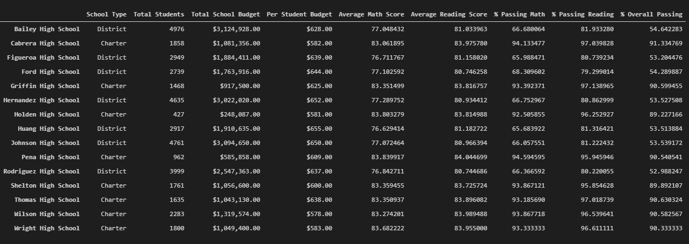
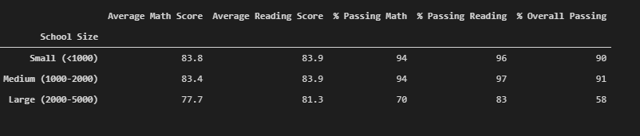

# School_District_Analysis
Using data analytics packages to gain unique insights

## Overview

### Purpose

The purpose of this analysis was to explore historic data from district and charter schools in the US, and to try and determine unique insights based off metrics like budget, population, and test scores. We use pandas DataFrames and some functions from the NumPy library to clean the initial dataset, and then omit certain values based off exclusion parameters (suspicion of academic dishonesty). We then conduct some summary statistics by arbitrarily grouping schools into different categories, like population or per-capita budget.

Technologies Used:

* Python 3.7.6 & Jupyter Notebook
* Modules: pandas, NumPy
* Data Source: schools_data_set, students_data_set (.csv)

## Results

The initial analysis contained data from Thomas High School's 9th grade class. However, it is later determined that this class was under suspicion for rampant academic dishonesty. So as not to corrupt the remaining analysis, the choice was made to exclude this class.

Once the exclusion was made, some key differences were apparent:

### District Summary

| Description              | DataFrame                                                  |
|--------------------------|------------------------------------------------------------|
| District Summary: Before |  |
| District Summary: After  |   |

- No siginficant changes were seen when excluding Thomas High School's 9th grade class from the original analysis
--------------------------------------
### School Summary

| Description                                            | DataFrame                                              |
|--------------------------------------------------------|--------------------------------------------------------|
| School Summary: Before                                 |  |
| School Summary: THS 9th Grade removed                  |  |
| School Summary: After replacing with THS 10-12th Grade |    |

- As seen, there was no significant changes seen when excluding the 9th grade class of Thomas High School from the analysis. In the modified dataset, the 10-12th grade scores are similar to what was seen before when the 9th grade data was included
--------------------------------------

### Math Scores By Grade

| Description                  | DataFrame                                              |
|------------------------------|--------------------------------------------------------|
| Math Scores by Grade: Before |  |
| Math Scores by Grade: After  |    |

### Reading Scores By Grade

| Description                     | DataFrame                                                    |
|---------------------------------|--------------------------------------------------------------|
| Reading Scores by Grade: Before |  |
| Reading Scores by Grade: After  |    |

- Conclusion: 
--------------------------------------

### Scores by Per-Student Capita

| Description                          | DataFrame                                                 |
|--------------------------------------|-----------------------------------------------------------|
| Scores by Per-Student Capita: Before |  |
| Scores by Per-Student Capita: After  |    |

- Conclusion: 
--------------------------------------
### Scores by School Size

| Description            | DataFrame                                           |
|------------------------|-----------------------------------------------------|
| Scores by Size: Before |  |
| Scores by Size: After  |    |

- Conclusion: 
--------------------------------------
### Scores by School Type (District vs Charter)

| Description            | DataFrame                                           |
|------------------------|-----------------------------------------------------|
| Scores by Type: Before |  |
| Scores by Type: After  |    |

- Conclusion: 
--------------------------------------

## Summary

Four major changes between the original analysis and the updated analysis

- 
- 
- 
- 

